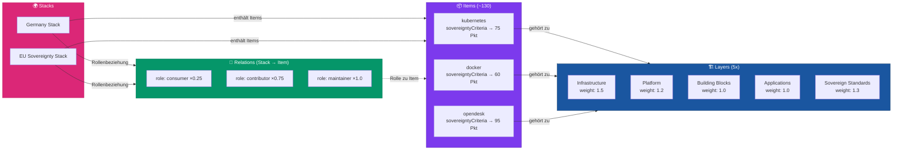

# data/ — Digital Stack Landscape Daten

Dieses Verzeichnis enthält alle Daten für die accessible-d-stack Anwendung in strukturierter JSON-Form.

## Verzeichnisstruktur

```
data/
├── layers/           # Die 5 Splash-Stack-Layer
├── items/            # Technologien, Standards und Tools
├── stacks/           # Regierungs- und Organisations-Stacks
├── relations/        # Relationen zwischen Items
└── schemas/          # JSON Schema Validierungsdateien
```

## Übersicht

| Verzeichnis  | Beschreibung                           | Format      | Validierung            |
| ------------ | -------------------------------------- | ----------- | ---------------------- |
| `layers/`    | Die 5 konzeptionellen Ebenen           | JSON        | `layer.schema.json`    |
| `items/`     | Alle Technologien & Standards          | JSON        | `item.schema.json`     |
| `stacks/`    | Gov-Stacks mit Item-Empfehlungen       | JSON        | `stack.schema.json`    |
| `relations/` | Stack-Item Relationen mit Souveränität | JSON        | `relation.schema.json` |
| `schemas/`   | JSON Schema Definitionen               | JSON Schema | -                      |

## Datenmodell: Layers → Items → Stacks → Relations



## Scoring-Modell

### Formel

```
Item-Score (intrinsisch)     = Σ sovereigntyCriteria (0–100 Punkte)
Rollen-Multiplikator         = maintainer: 1.0 | contributor: 0.75 | funder: 0.5 | consumer: 0.25
Kombinierter Item-Score      = Item-Score × Rollen-Multiplikator
Layer-Durchschnitt           = Ø aller kombinierten Item-Scores eines Layers
Gewichteter Stack-Score      = Σ(Layer-Durchschnitt × Layer-Weight) / Σ(Layer-Weight)
```

### Beispiel

```
Kubernetes:     sovereigntyCriteria = 75 Pkt, Rolle = consumer (×0.25) → 18.75
openDesk:       sovereigntyCriteria = 95 Pkt, Rolle = maintainer (×1.0) → 95.0
Phoenix:        sovereigntyCriteria = 90 Pkt, Rolle = funder (×0.5)    → 45.0

Layer "Applications" (weight: 1.0): Ø(95.0, 45.0) = 70.0
Layer "Infrastructure" (weight: 1.5): Ø(18.75)     = 18.75

Stack-Score = (70.0×1.0 + 18.75×1.5) / (1.0 + 1.5) = 39.25
```

### Verantwortlichkeiten pro Schema

| Schema       | Verantwortung                                                 |
| ------------ | ------------------------------------------------------------- |
| **Item**     | Intrinsischer Souveränitäts-Score (aus `sovereigntyCriteria`) |
| **Layer**    | Gewichtung (`weight`) für Gesamtberechnung                    |
| **Stack**    | Welche Items enthalten sind + Status + Teilnehmer-Metadaten   |
| **Relation** | Rollenbeziehung Land↔Item (Multiplikator für Scoring)         |

## Daten-Pipeline

```
CSV-Daten (Quelle)
        ↓
    Migrate-Skript
        ↓
    JSON-Dateien (hier)
        ↓
    Validationsskript (validate-schemas.mjs)
        ↓
    TypeScript Generation (generate-data.mjs)
        ↓
    React/Preact Komponenten
```

## Wichtige Richtlinien

- **Keine manuellen Änderungen**: Verwenden Sie die Upload/Import-Funktionen
- **Schema-Validierung**: Alle Dateien werden gegen ihre Schemas validiert
- **Versionskontrolle**: Alle JSON-Dateien sollten im Git versioniert sein
- **Backup**: Sichern Sie Daten vor dem Löschen von Items/Stacks

## Weitere Informationen

- [data/layers/README.md](layers/README.md)
- [data/items/README.md](items/README.md)
- [data/stacks/README.md](stacks/README.md)
- [data/relations/README.md](relations/README.md)
- [data/schemas/README.md](schemas/README.md)
